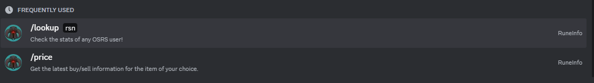
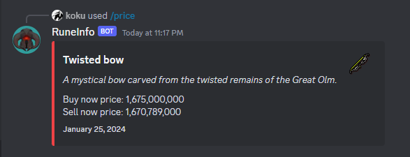

# RuneInfo

*RuneInfo is a simple, but effective discord bot that allows you to view in game information through discord. Such as, item prices, player stats or boss kill count.*

## Getting Started

### Adding to your discord

* Simply visit [this link](https://discord.com/api/oauth2/authorize?client_id=1087515684453486613&permissions=826781534208&scope=bot%20applications.commands) then, add the discord bot to your server and ensure that it is allowed to use cross-discord emojis

### Executing program

* Currently there two commands available on RuneInfo
* Using a command just requires the user to use `/` or look at the `Slash Commands` available in the discord chat.

Afterwards the user will get a repsonse from the bot with the requested information!

